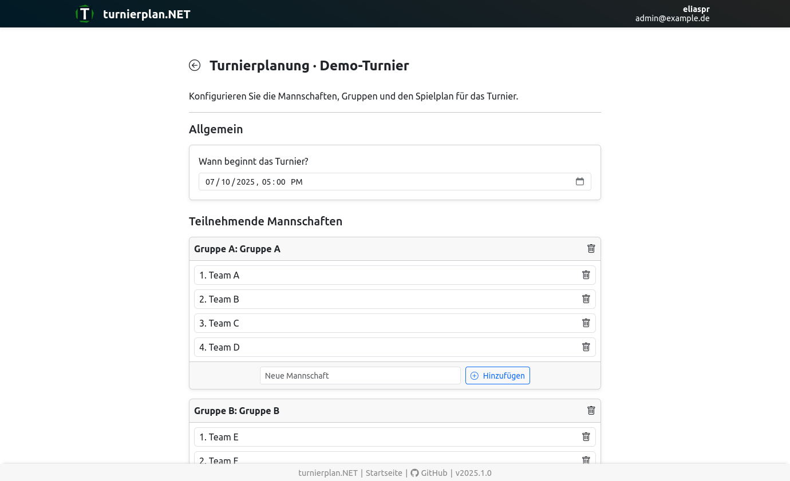
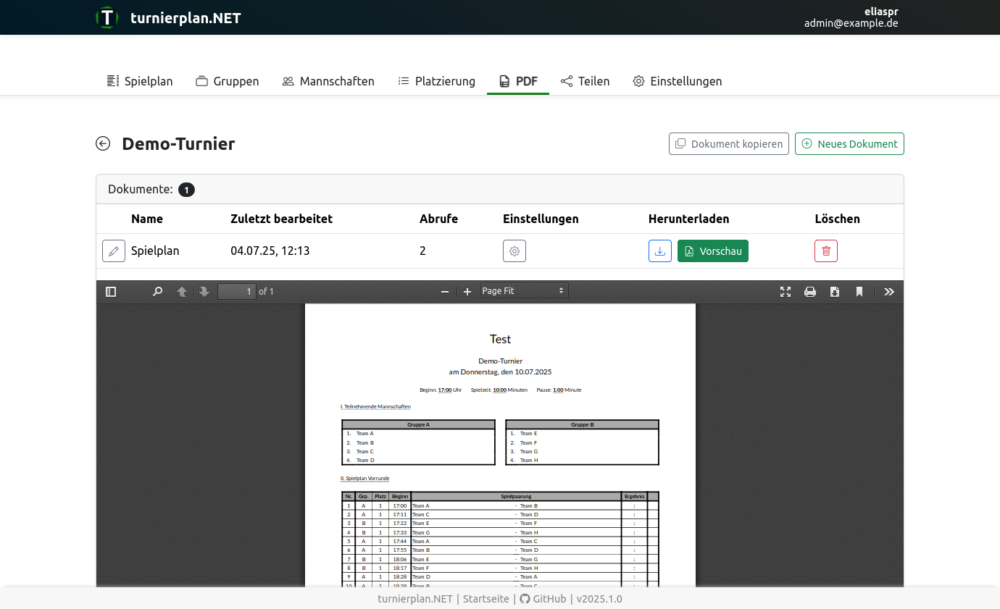
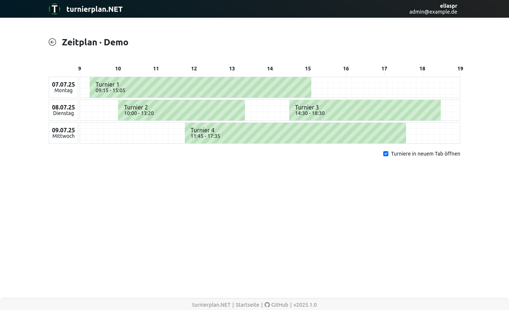
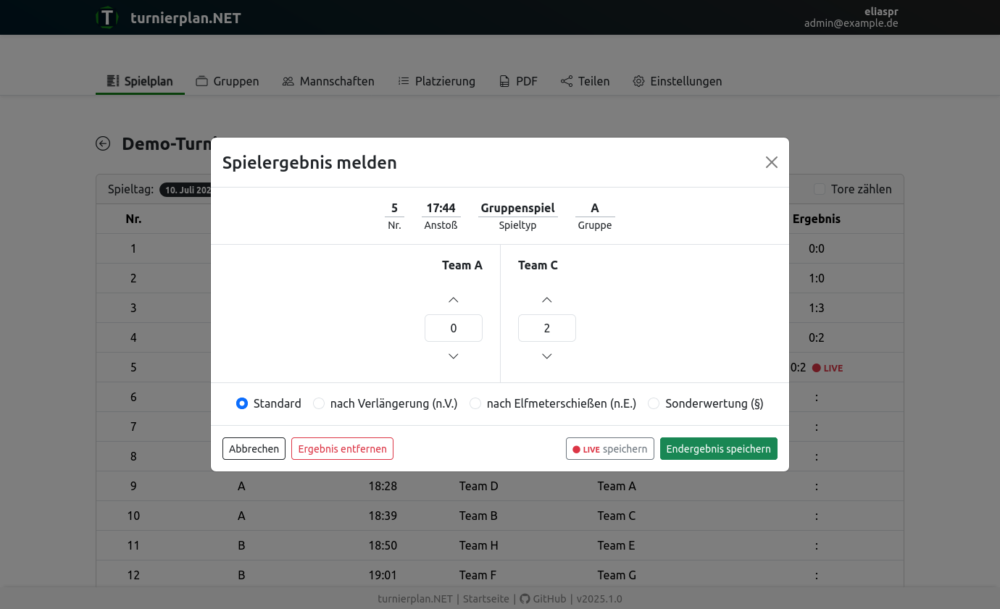

# turnierplan.NET

*An open-source tournament planning application for football clubs*

[](https://github.com/turnierplan-NET/turnierplan.NET/actions/workflows/validate.yaml) [](https://sonarcloud.io/summary/new_code?id=turnierplan-NET_turnierplan.NET) [](https://sonarcloud.io/summary/new_code?id=turnierplan-NET_turnierplan.NET) [](https://sonarcloud.io/summary/new_code?id=turnierplan-NET_turnierplan.NET) [](https://sonarcloud.io/summary/new_code?id=turnierplan-NET_turnierplan.NET)

## Introduction

**turnierplan.NET** is mostly written in C# using [.NET](https://dotnet.microsoft.com/). This includes the core logic, the backend API and database connection as well as all publicly visible web pages. In addition, it serves the *turnierplan.NET portal*, the client application for authenticated users, based on the [Angular](https://angular.dev/) framework. Some screenshots can be seen in the [section at the end](#screenshots).

This readme describes how to deploy the application using the pre-built containers or how to get a local development environment up and running.

> [!NOTE]  
> The user interface is currently only available in German 🇩🇪

## Deployment

**turnierplan.NET** comes as a pre-built container image which can be deployed with minimal configuration. The image is available on GitHub: [ghcr.io/turnierplan-net/turnierplan](https://github.com/turnierplan-NET/turnierplan.NET/pkgs/container/turnierplan)

In the simplest case, run the container directly using the following command. Make sure to substitute the correct PostgreSQL database connection string:

```shell
docker run -p 80:8080 -e ApplicationUrl="http://localhost" -e Database__ConnectionString="" ghcr.io/turnierplan-net/turnierplan:latest
```

The credentials of the initial admin user are displayed in the container logs.

> [!CAUTION]
> In a production environment, you should immediately change the administrator password to a secure one!

### Persisting Data

To persist the **turnierplan.NET** application data, create a Docker volume mapping to the `/var/turnierplan` folder inside the container.

> [!CAUTION]
> This folder contains the JWT signing key for issued access/refresh tokens.

### Environment Variables

For a basic installation, the following environment variables *must* be set:

| Environment Variable         | Description                                                  |
|------------------------------|--------------------------------------------------------------|
| `ApplicationUrl`             | The URL used to access the website.                          |
| `Database__ConnectionString` | The PostgreSQL connection string with read/write permission. |

The following environment variables *can* be set if you want to enable specific features or modify default behavior:

| Environment Variable                    | Description                                                                                                                                                                      | Default      |
|-----------------------------------------|----------------------------------------------------------------------------------------------------------------------------------------------------------------------------------|--------------|
| `ApplicationInsights__ConnectionString` | Can be set if you wish that your instance sends telemetry data to [Azure Application Insights](https://learn.microsoft.com/en-us/azure/azure-monitor/app/app-insights-overview). | -            |
| `Identity__AccessTokenLifetime`         | Defines the lifetime of issued JWT access tokens.                                                                                                                                | `00:30:00`   |
| `Identity__RefreshTokenLifetime`        | Defines the lifetime of issued JWT refresh tokens.                                                                                                                               | `1.00:00:00` |

> The token lifetimes must be specified as .NET `TimeSpan` strings. For example `00:30:00` means 30 minutes or `1.00:00.00` means 1 day.

### Docker Compose Example

You can use the following docker compose file to get a complete instance running on your machine:

```yaml
services:
  turnierplan.database:
    image: postgres:latest
    environment:
      - POSTGRES_PASSWORD=P@ssw0rd
      - POSTGRES_DB=turnierplan
    volumes:
      - turnierplan-database-data:/var/lib/postgresql/data
    networks:
      - turnierplan
    restart: unless-stopped

  turnierplan.app:
    image: ghcr.io/turnierplan-net/turnierplan:latest
    depends_on:
      - turnierplan.database
    environment:
      - ApplicationUrl=http://localhost
      - Database__ConnectionString=Host=turnierplan.database;Database=turnierplan;Username=postgres;Password=P@ssw0rd
    volumes:
      - turnierplan-app-data:/var/turnierplan
    networks:
      - turnierplan
    restart: unless-stopped
    ports:
      - '80:8080'

volumes:
  turnierplan-database-data:
  turnierplan-app-data:

networks:
  turnierplan:
```

> [!TIP]
> It is recommended to *not* use the `latest` tag. Rather, pin your docker services to a specific image version.

## Documentation

The developer documentation of **turnierplan.NET** is located in the `docs` directory of this repository.

## Development

First, you need to install the following tools:

- .NET 9.0 SDK
- node.js v22.x and npm
- your favourite IDE

To run the application from source, follow these steps:

1. Open the `src/Turnierplan.sln` solution and navigate to the docker compose file located under `Solution Items`. Run the `turnierplan.database` docker compose service. This will start up the PostgreSQL database for local development.
2. Navigate to the `Turnierplan.App` project and run the `Turnierplan.App` launch configuration. This will start the backend using port `45000`. In the console output, you should find a log message similar to `An initial user was created...`. This log message will contain the credentials of the initially created administrator account. Write down the password as it will not be shown again.
3. Open a terminal and navigate to the `src/Turnierplan.App/Client` directory. Run `npm install` to install the node dependencies. Next, you can start the client application by typing `npm run start`. Note that this will only work if the backend application has previously been run because the client app startup depends on OpenAPI files generated by the backend build process.
4. Access the client application using [http://localhost:45001](http://localhost:45001) and log in using the credentials you got from step `2`.

When running locally, the API documentation can be viewed by opening [http://localhost:45000/scalar](http://localhost:45000/scalar).

## Screenshots

Below are some screenshots of the application:

1. *Creating a new tournament*  
   
2. *Exporting a tournament to PDF document*    
   
3. *Viewing a timetable of multiple tournaments*
   
4. *Reporting the outcome of a match*
   

## Turnierplan.Adapter

If you want to use the **turnierplan.NET** API programatically in a .NET environment, you can use the `Turnierplan.Adapter` [package](https://www.nuget.org/packages/Turnierplan.Adapter) which contains all model classes and an abstraction layer to easily query the API endpoints.

Add the package reference to your project:

```csproj
<ItemGroup>
  <PackageReference Include="Turnierplan.Adapter" Version="2025.1.0" /> <!-- Use the latest version! -->
</ItemGroup>
```

In your program, instantiate the `TurnierplanClient` class providing your API key. Finally, you can query the API!

```cs
var config = new TurnierplanClientOptions("http://localhost:45000", "<ApiKey>", "<ApiKeySecret>")
{
  UserAgent = "<YourApplicationName>"
};

using var client = new TurnierplanClient(config);

var x = await client.GetTournaments("<FolderId>");
var y = await client.GetTournament("<TournamentId>");
```
