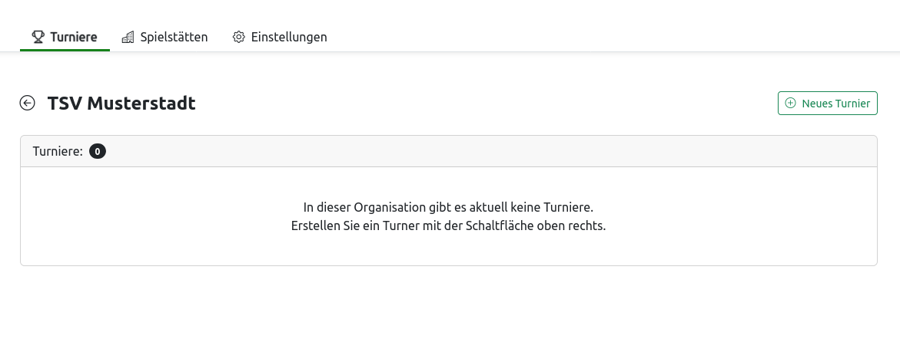
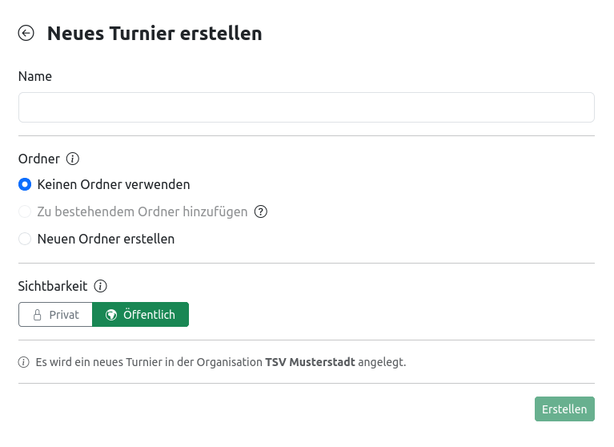
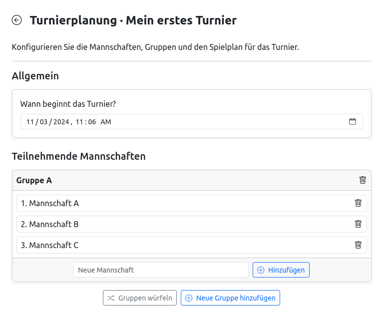
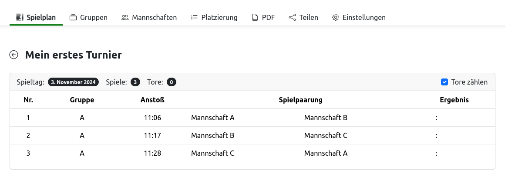
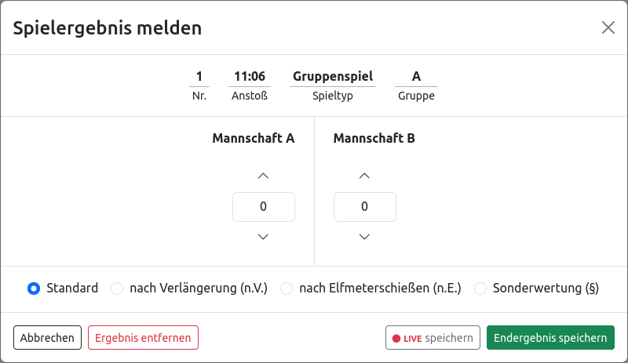
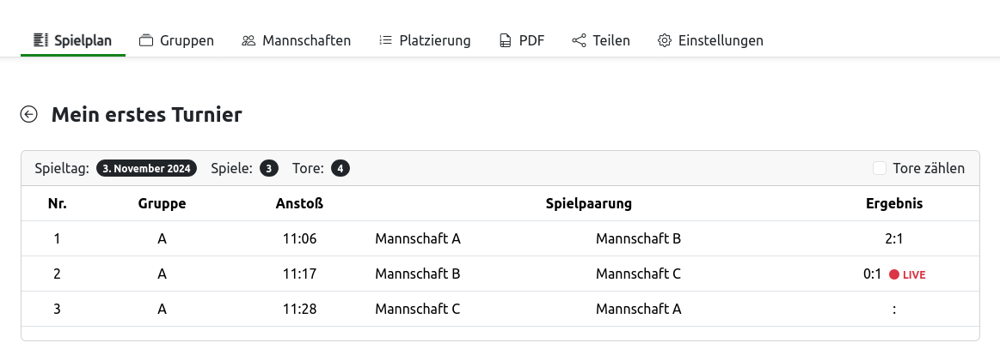
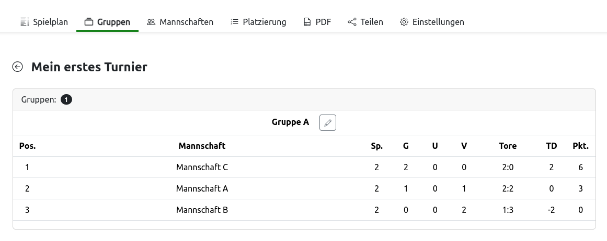

# Erste Schritte

Nach einer Neuinstallation von turnierplan.NET gibt es zunächst nur einen Administratorbenutzer. Für produktive Anwendungen ist es dringend empfohlen, einen nicht-Adminnutzer anzulegen, und diesen für den täglichen Login zu verwenden. Dies wird im folgenden Abschnitt beschrieben. Es können jedoch auch mit dem Administratorbenutzer Turniere angelegt werden. Dies ist im Abschnitt weiter unten beschrieben.

## Benutzer anlegen

Zunächst muss sich mit den Zugangsdaten des Administratorbenutzers angemeldet werden. Auf der Startseite ist folgend der *Administrator*-Button sichtbar, welcher zum Administrator-Portal führt. Dort kann ein neuer Benutzer angelegt werden. Zwingend angegeben werden müssen der Benutzername und das Passwort des neuen Benutzers. Nachdem ein Benutzer erstellt wurde, muss ihm noch die Berechtigung erteilt werden, Organisationen zu erstellen. Hierfür muss man in der Zeile des Benutzers auf das Bearbeiten-Symbol drücken, den Haken bei *Benutzer darf neue Organisationen anlegen* setzen und speichern. Anschließend kann der Benutzer sich anmelden und eigenständig neue Organisationen erstellen.

## Organisation erstellen

Alle Turniere und andere Objekte, welche innerhalb von turnierplan.NET erstellt werden können, sind immer einer Organisation zugehörig. Eine neue Organisation kann jederzeit auf der Startseite erstellt werden und benötigt lediglich einen Namen.

!!! tip
    Durch die Trennung der Daten in mehrere Organisationen kann gesteuert werden, welche Benutzer innerhalb von welchen Organisationen Daten lesen und Änderungen vornehmen können.

Für den Start genügt zunächst eine einzelne Organisation.

## Turnier erstellen

Ein neues Turnier kann innerhalb einer bestehenden Organisation mit der Schaltfläche *Neues Turnier* erstellt werden:

In der Eingabemaske, welche sich darauf öffnet, müssen folgende Informationen bereitgestellt werden:

- **Name**: Kann frei gewählt werden.
- **Ordner**: Kann optional verwendet werden, um mehrere Turniere zu gruppieren. Dies hat diverse Vorteile, welche separat beschrieben werden.
- **Sichtbarkeit**: Wenn ein Turnier auf *öffentlich* gestellt wird, kann jeder das Turnier mit einem speziellen Link sehen. Wenn das Turnier auf *privat* gestellt wird, kann das Turnier nur als angemeldeter Benutzer gesehen werden.

Alle o.g. Informationen können nachträglich geändert werden. Nach der Bestätigung der Eingaben öffnet sich die Konfigurationsseite des neu erstellen Turniers:

### Spielplan konfigurieren

Auf der Konfigurationsseite wird festgelegt, welche Mannschaften am Turnier teilnehmen, wie diese Mannschaften in Gruppen aufgeteilt sind und welchen Spielmodus das Turnier verwendet.

Für ein einfaches Turnier genügen die folgenden beiden Schritte::

- Erstellen Sie eine neue Gruppe mit der Schaltfläche *Neue Gruppe hinzufügen*
- Legen Sie innerhalb der Gruppe drei Mannschaften an, indem Sie einen Namen in das Textfeld eingeben und die Schaltfläche *Hinzufügen* betätigen

Die Turnierkonfiguration sieht nun folgendermaßen aus (der untere Teil der Seite ist nachfolgend nicht abgebildet):

Die Änderungen werden erst übernommen, wenn die *Übernehmen*-Schaltfläche am Ende der Seite geklickt wird.

Anschließend erfolgt eine Weiterleitung auf die Startseite des Turniers. Dort ist der erstellte Spielplan nun sichtbar:

### Turnierdurchführung

Bei der Turnierdurchführung werden nacheinander die Ergebnisse der Spiele in den Spielplan eingetragen. Beim Klick auf eines der Spiele öffnet sich hierzu folgender Dialog:

Der Dialog zeigt die Spielpaarung und bietet die Möglichkeit, für die teilnehmenden Mannschaften die jeweilige Anzahl der Tore einzutagen. Zudem kann neben einem Standardergebnis auch zwischen *n.V.*, *n.E.* oder der sog. *Sonderwertung* entscheiden werden. Letztere eignet sich z.B. im Fall, dass eine Mannschaft nicht angetreten ist.

Ein Ergebnis kann als *LIVE-Ergebnis* oder als *Endergebnis* gespeichert werden. Spiele mit *LIVE-Ergebnis* werden optisch gekennzeichnet und zählen zudem noch nicht in die Gruppenwertung ein. Erst wenn bei einem Spiel das *Endergebnis* gespeichert wird, zählt das Spiel als beendet.

Im folgenden Beispiel ist Spiel 1 beendet und Spiel 2 ist derzeit am Laufen:

Nach jedem beendeten Spiel werden alle Gruppen durchgerechnet. Beim Klick auf den Reiter *Gruppen* wird die Gruppenstatistik sichtbar:

Da es in diesem Turnier nur eine Gruppe sowie keine Finalrunde gibt, ist dies auch gleichzeitig die Endplatzierung des Turniers.
