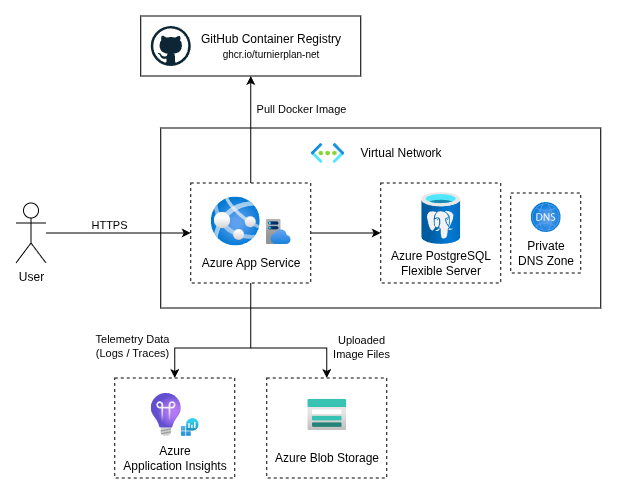
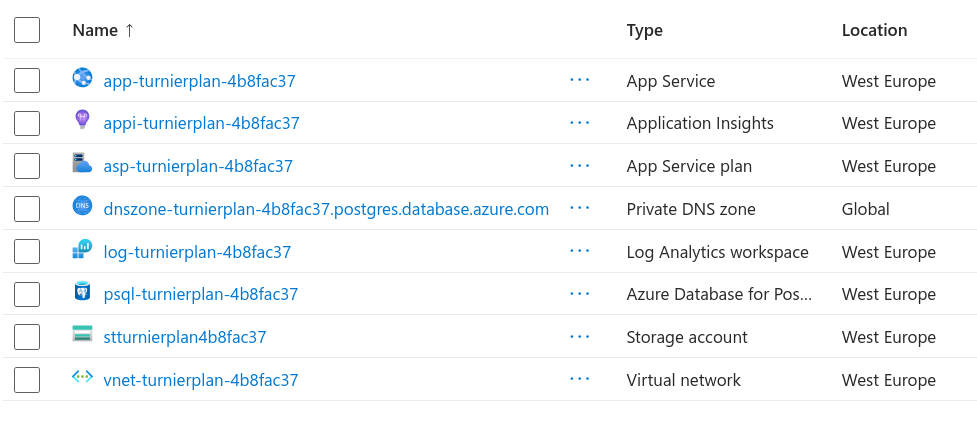

# Microsoft Azure (Terraform)

Dieser Artikel beschreibt das Deployment von turnierplan.NET auf Microsoft Azure mithilfe des IaC-Tools Terraform.

## Architektur

Die Cloud-Architektur umfasst im Wesentlichen einen Azure App Service sowie eine verwaltete Azure PostgreSQL-Datenbank. Ergänzt werden diese Services von Azure Application Insights zur Erfassung von Telemetriedaten sowie von einem Azure Blob Storage Account, worin die hochgeladenen Bilddateien gespeichert werden. Für die Authentifizierung beim Storage Account verwendet der App Service eine System-Assigned Managed Identity. Um die Datenbank vor Zugriffen aus dem Internet zu schützen, wird für App Service und Datenbank ein virtuelles Netzwerk inklusive Subnetzen verwendet. Der Endnutzer greift direkt per HTTPS auf den Azure App Service zu. Hierbei wird entweder der Standard-Domainname verwendet - oder, optional, ein eigens definierter Domainname.



## Verwendung

Um das Modul zu verwenden, muss zunächst Terraform installiert sein. Zudem müssen die Provider `hashicorp/azurerm` und `hashicorp/random` verfügbar sein. Mit dem nachfolgenden Terraform-Skript kann das Terraform-Modul direkt aus der [GitHub-Repository](https://github.com/turnierplan-NET/turnierplan.NET-Terraform-Azure) verwendet werden.

```terraform
module "turnierplan" {
  source = "github.com/turnierplan-NET/turnierplan.NET-Terraform-Azure?ref=2026.2.0"

  # Use a name with a unique suffix to prevent naming collisions
  name     = "turnierplan-example"
  location = "westeurope"

  # DON'T set a secure admin password here! Run the deployment, then log in using credentials
  # specified below and change the admin password to a secure one in the web UI afterwards.
  turnierplan_initial_user      = "admin"
  turnierplan_initial_password  = "admin"

  turnierplan_additional_app_settings = {
    # Additional settings as defined in the documentation: https://docs.turnierplan.net/configuration
    "Turnierplan__InstanceName" = "turnierplan.NET on Azure"
  }

  app_service_custom_domain        = null
  app_service_plan_sku_name        = "B1"
  app_insights_retention_in_days   = 90
  storage_account_replication_type = "GRS"
  postgresql_availability_zone     = 3
  postgresql_sku_name              = "B_Standard_B1ms"
  postgresql_storage_size_mb       = 32768
  postgresql_storage_tier          = "P4"
  postgresql_charset               = "UTF8"
  postgresql_collation             = "de_DE.utf8"
}
```

!!! info
    Der Wert der Variable `name` wird als Suffix für die Namen aller erstellten Ressourcen verwendet. Um Konflikte bei global eindeutigen Ressourcennamen zu vermeiden, sollte der verwendete `name` möglichst eindeutig sein. Allerdings sollte der `name` nicht zu lang sein, da bei bestimmten Ressourcen auch Längenbegrenzungen für den Namen gelten.

!!! danger
    Die PostgreSQL-Datenbank ist *ohne* Hochverfügbarkeit konfiguriert. Es wird nur ein Replika in der spezifizierten Availability Zone (`postgresql_availability_zone`) erstellt - vgl. [Terraform-Doku](https://registry.terraform.io/providers/hashicorp/azurerm/latest/docs/resources/postgresql_flexible_server) und [Microsoft-Doku](https://learn.microsoft.com/en-us/azure/postgresql/high-availability/concepts-high-availability)

Die folgenden Azure-Ressourcen werden durch das Modul erstellt:



Nachdem das Deployment alle Ressourcen erstellt hat, kann auf die Weboberfläche mit der Domain des Azure App Service zugegriffen werden. Anschließend ist der Login mit den festgelegten Zugangsdaten möglich. Weitere Schritte sind auf der entsprechenden Seite [Erste Schritte](../getting-started/index.md) der Dokumentation beschrieben.

## Aktualisierung

Die verwendete Version von turnierplan.NET kann jederzeit auf eine neuere aktualisiert werden. Etwaige Datenbankmigrationen werden beim ersten Start sequenziell angewandt - auch wenn Versionen übersprungen werden. Allerdings sollten vor jeder Aktualisierung *immer* die [Release-Notes](https://github.com/turnierplan-NET/turnierplan.NET/releases) gelesen werden! Es kann jederzeit nicht-rückwärtskompatible Änderungen geben.
